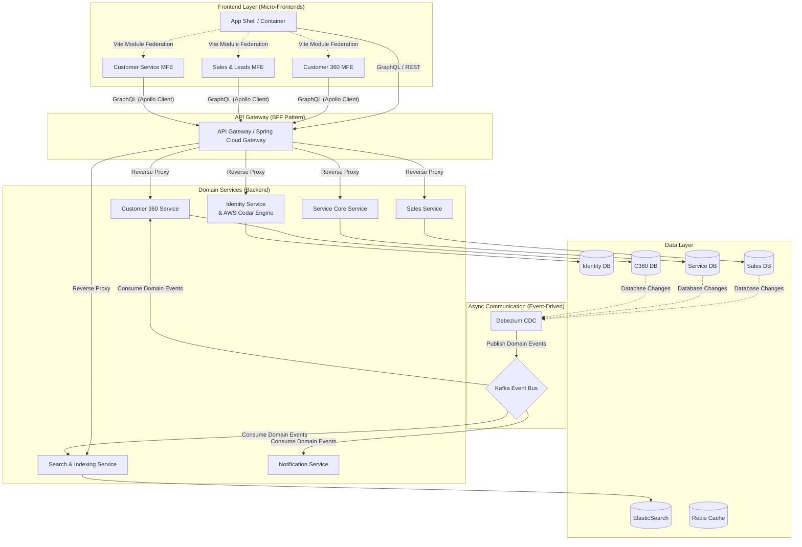

Built with **React**, **Vite** (Module Federation), **Apollo Client** (GraphQL), **Java**, **Spring Cloud Gateway**, **Spring Boot GraphQL**, **AWS Cedar SDK**, **Kafka**, **Debezium**, **PostgreSQL**, **Elasticsearch**, and **Redis**.
