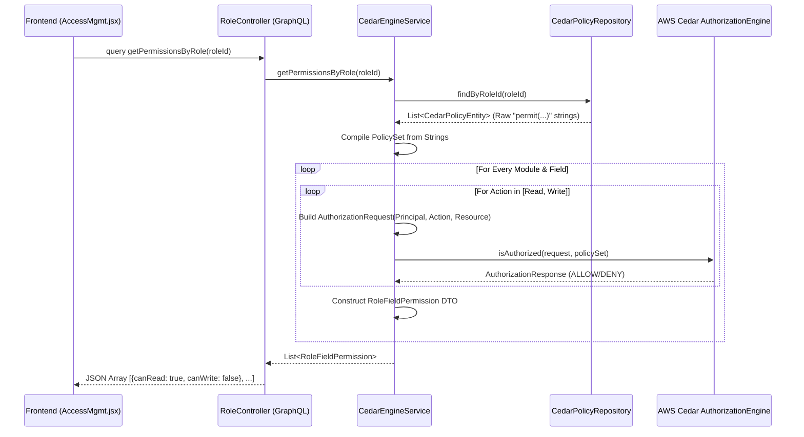
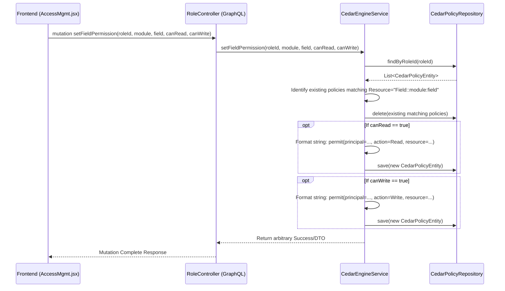

# Identity Service - Cedar Policy Sequence Diagrams

This document outlines the interaction flows between the Frontend, GraphQL Controllers, and the embedded AWS Cedar Engine within the `identity-service`.

## 1. Evaluating Access (Reading Permissions)
When a user accesses the Access Management UI or when the system needs to determine field-level permissions, the frontend requests the current state. The `identity-service` dynamically evaluates Cedar statements to generate this state.

## 2. Modifying Access (Writing Permissions)
When an administrator modifies a user's permissions via the UI, the system translates this interaction into an updated AWS Cedar policy string and stores it in the database.

## How Cedar is Leveraged
The system uses the embedded `cedar-java` library. Rather than storing boolean flags in rows, the database stores raw Cedar policy code (`CedarPolicyEntity.policyContent`). The Java application layer translates user concepts into Cedar `EntityUID` tokens (e.g. `Role::"ADMIN"`, `Action::"Read"`, `Field::"sales:status"`). 

Because Cedar is executed completely in-memory via the SDK instance (`authorizationEngine.isAuthorized`), evaluating hundreds of fields takes milliseconds, keeping the architecture performant while vastly improving security rule flexibility.
