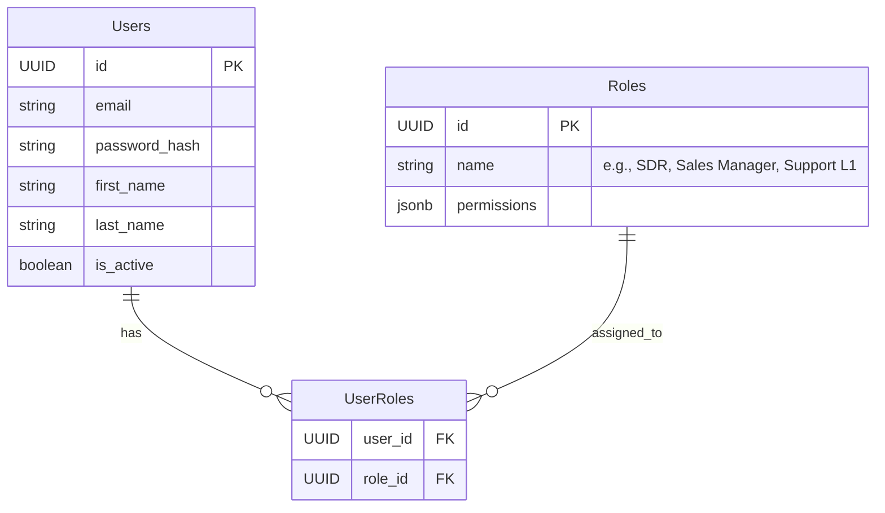
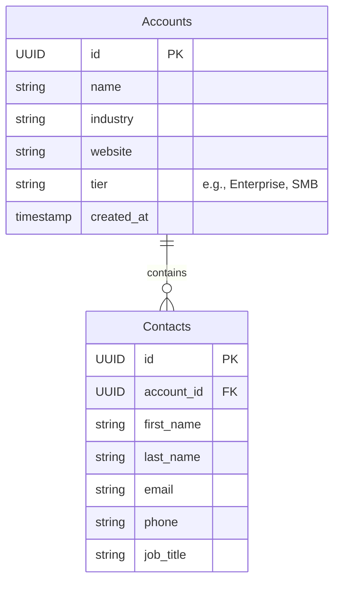
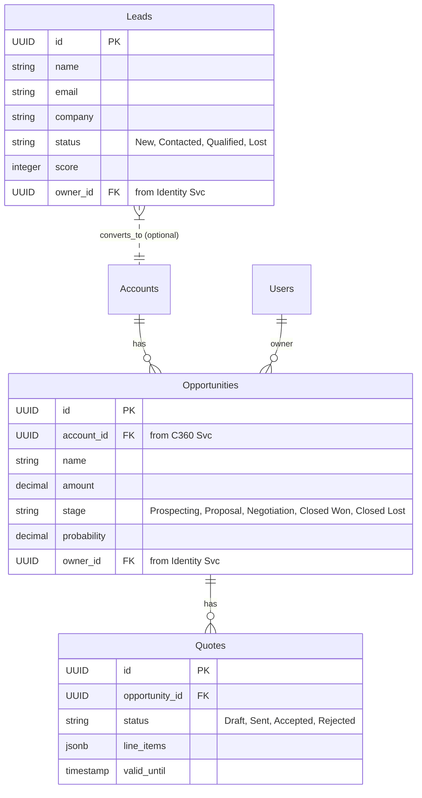
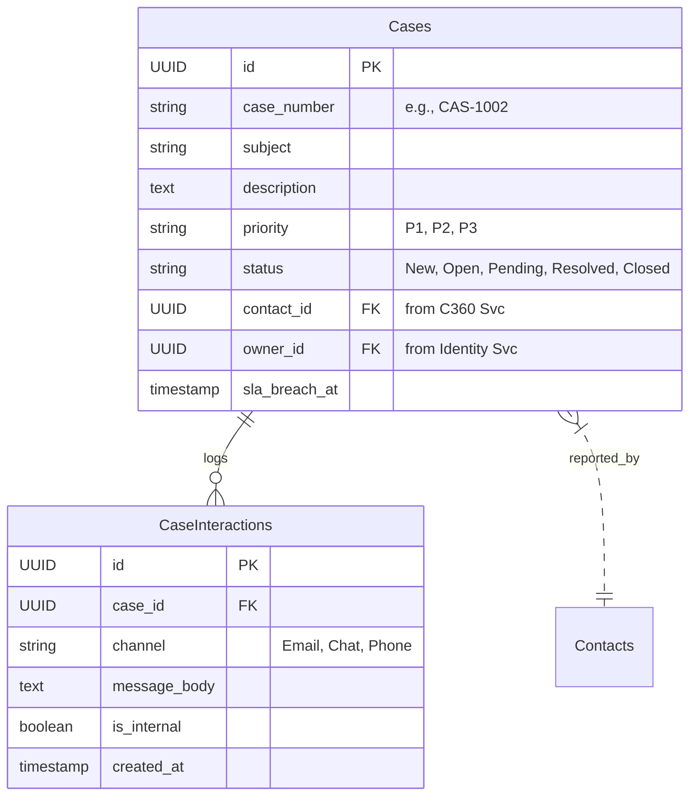

# Enterprise CRM Implementation Plan

This document outlines the foundational implementation plan for building the Enterprise CRM application, bridging Sales and Service functions.

## 1. Project Structure & Microservices Setup

We will adopt a multi-module Maven/Gradle structure or separate repositories per microservice. Given the existing architecture context, the backend services will be Spring Boot applications exposing GraphQL or REST APIs.

### The Microservices:
*   **`api-gateway`**: Spring Cloud Gateway / BFF routing to internal services.
*   **`identity-service`**: Manages Users, Authentication, and RBAC. (PostgreSQL)
*   **`c360-service`**: Customer 360 view managing Accounts and Contacts. (PostgreSQL)
*   **`sales-service`**: Manages Leads, Opportunities, and Quotes. (PostgreSQL)
*   **`service-core-service`**: Manages Cases/Tickets, SLAs, and Knowledge Base. (PostgreSQL / MongoDB limit depending on KB requirements)
*   **`search-service`**: Elasticsearch consumer for global search.
*   **`notification-service`**: Sends emails and internal UI notifications.

### Inter-Service Communication:
*   **Synchronous**: API Gateway $\\to$ Domain Services (GraphQL/REST).
*   **Asynchronous (Event-Driven)**: Kafka will be used for state changes (e.g., `LeadConvertedEvent`, `TicketCreatedEvent`). We will implement the **Transactional Outbox Pattern** with Debezium for reliable event publishing.

---

## 2. Database Schemas (ERDs)

### A. Identity Service (Auth DB)

### B. Customer 360 Service (C360 DB)

### C. Sales Service (Sales DB)

### D. Service Core (Tickets DB)

---

## 3. Recommended Phased Approach

1.  **Phase 1: Foundation Server Setup.** Initialize polyglot environments (Kafka, Postgres, Redis inside `docker-compose`) and basic routing (API Gateway).
2.  **Phase 2: Identity & C360.** Implement auth, user creation, and the core Account/Contact structures.
3.  **Phase 3: Sales vs. Service Core.** Build out Lead/Opportunity management or Case management.
4.  **Phase 4: Eventing & Global Search.** Integrate Debezium/Kafka to stream updates into elasticsearch for the 360 views.

## User Review Required

> [!IMPORTANT]
> Please review the ERDs and microservice boundaries above. 
> 
> Once approved, we can proceed to set up the **initial Microservices Structure**, creating the base Spring Boot projects and Docker Compose files.
> Also, please let me know which module you'd prefer to deep dive into first: **Sales Core** or **Service Core**?
